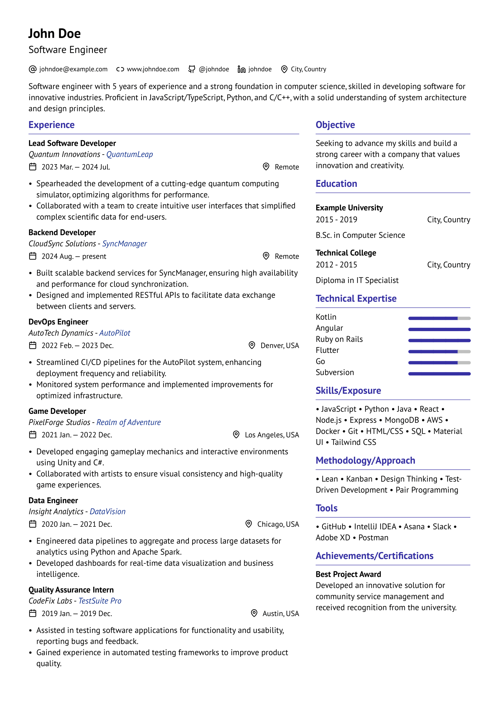

= Vantage Typst

An ATS friendly simple Typst CV template, inspired by https://github.com/GeorgeHoneywood/alta-typst[alta-typst by George Honeywood]. See link::example.pdf[example.pdf] for the rendered PDF output.

== Features

* *Two-column layout*: Experience on the left and other important details on the right, organized for easy scanning.
* *Customizable icons*: Add and replace icons to suit your personal style.
* *Responsive design*: Adjusts well for various print formats.

== Usage

=== Running Locally with Typst CLI

. *Install Typst CLI*: Follow the installation instructions on the https://github.com/typst/typst#installation[Typst CLI GitHub page] to set up Typst on your machine.
. *Clone the repository*:

[source,bash]
----
git clone https://github.com/sardorml/vantage-typst.git
cd vantage-typst
----

. *Run Typst*:
Use the following command to render your CV:

[source,bash]
----
typst compile example.typ
----

This will generate a PDF output in the same directory.

. *Edit your CV*:
Open the `example.typ` file in your preferred text editor to customize the layout.

=== Configuration

You can easily customize your personal data by editing the `configuration.yaml`
file. This file allows you to set your name, contact information, work
experience, education, and skills. Here’s how to do it:

. Open the `configuration.yaml` file in your text editor.
. Update the fields with your personal information.
. Save the file, and your CV will automatically reflect these changes when you compile it.

== Icons

You can enhance your CV with additional icons by following these steps:

. *Upload Icons*: Place your `.svg` files in the `icons/` folder.
. *Reference Icons*: Modify the `links` array in the Typst file to include your
  new icons by referencing their filenames as the `name` values.

.Example:
[source,typst]
----
links: [
    { name: "your-icon-name", url: "https://example.com" },
]
----

For existing icons, the current selection is sourced from https://lucide.dev/icons/[Lucide Icons].

== License

This project is licensed under the link::./LICENSE[MIT License]

Icons are from Lucide Icons and are subject to https://lucide.dev/license[their terms].

== Acknowledgments

* Inspired by the work of https://github.com/GeorgeHoneywood/alta-typst[George Honeywood].
* Thanks to https://lucide.dev/icons/[Lucide Icons] for providing the icon library.

For any questions or contributions, feel free to open an issue or submit a pull request!
